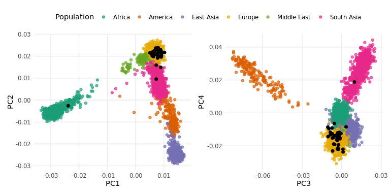
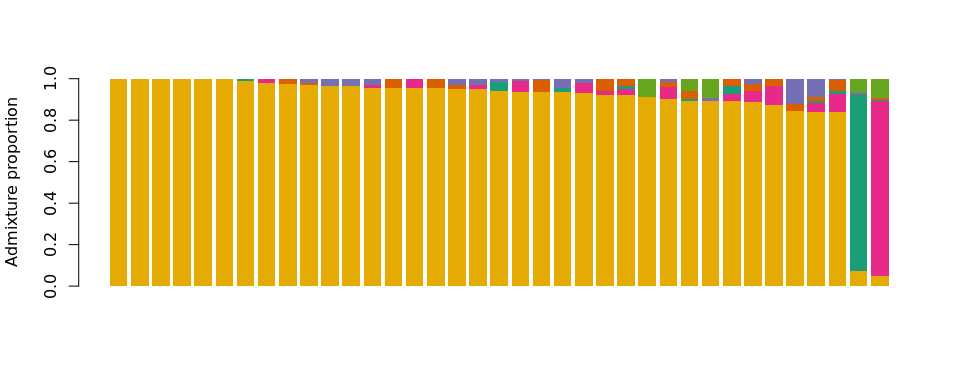

# Tutorial on genetic-ancestry inference using scRNA data
Jianing Yao

- [<span class="toc-section-number">0.1</span> QC](#qc)
- [<span class="toc-section-number">0.2</span> PCA-Distance
  analysis](#pca-distance-analysis)
- [<span class="toc-section-number">0.3</span> ADMIXTURE
  analysis](#admixture-analysis)

#### This tutorial demonstrates genetic-ancestry inference for a specific HCA study (Bone marrow), using SNPs derived from scRNA-seq following the steps in `Stage1_preprocessing`.

Software requirements: - PLINK (1.9):
https://www.cog-genomics.org/plink/ - ADMIXTURE (1.3.0):
https://dalexander.github.io/admixture/download.html

### QC

In the tutorial, we consider the harmonized HGDP+1kGP dataset as a
reference population dataset for genetic-ancestry inference and select
six genetic-ancestry groups (Africa, America, Europe, Middle East, East
Asia, and South Asia). We provided the reference dataset retaining only
variants located in exonic and untranslated regions (UTRs) in
`Tutorial/Stage2_ancestry_inference/HGDP_1kGP.exon_UTRS.tar.xz`. First,
we convert the VCF file from Stage 1 into PLINK format, perform data
quality control, restrict to common SNPs present in both the scRNA-seq
and reference datasets, and performing genetic pruning. Here, we analyze
the [bone marrow HCA
dataset](https://explore.data.humancellatlas.org/projects/2a72a4e5-66b2-405a-bb7c-1e463e8febb0)
as demonstration.

``` bash
# This block is command lines. 
# Set up
PLINK2="../../bin/plink1.9/plink"
# Note: Our recommended reference file is available at HGDP_1kGP.exon_UTRS.tar.xz. It contains 3,481 HGDP+1kGP individuals, and 302,006 common SNPs in coding exons and untranslated regions.
PCA_FILE="HGDP_1kGP.exon_UTRS"
tar -xJvf ../Stage2_ancestry_inference/$PCA_FILE.tar.xz
STUDY='StemCellsInChronicMyeloidLeukemia'
VCF='StemCellsInChronicMyeloidLeukemia.SNP.Filtered.SV.vcf.gz'
DIR=$STUDY
if [ ! -d "$DIR" ]; then
    mkdir -p "$DIR"
fi

#### Step 1: Convert your vcf into plink format and QC the data
$PLINK2 --const-fid 0 --vcf $VCF --geno 0.10 --make-bed --allow-extra-chr --out $DIR/$STUDY.plink.step1
$PLINK2 --bfile $DIR/$STUDY.plink.step1 --mind 0.10 --make-bed --allow-extra-chr --out $DIR/$STUDY.plink.step2
$PLINK2 --const-fid 0 --vcf $VCF --keep $DIR/$STUDY.plink.step2.fam --geno 0.10 --make-bed --allow-extra-chr --out $DIR/$STUDY.plink
rm $DIR/$STUDY.plink.step*

#### Step 2: Find rs ID and create a list with rs id in both scRNA dataset and the reference dataset
perl ../Stage2_ancestry_inference/annotate_rs_vcf.pl $DIR/$STUDY.plink $PCA_FILE
grep -v toremove $DIR/$STUDY.plink.bim | cut -f2 > $DIR/$STUDY.plink.list


#### Step 3: Merge the 2 files and perform pruning
$PLINK2 --bfile $DIR/$STUDY.plink --extract $DIR/$STUDY.plink.list --make-bed --out $DIR/$STUDY.tmp1 --allow-extra-chr
$PLINK2 --bfile $PCA_FILE         --extract $DIR/$STUDY.plink.list --make-bed --out $DIR/$STUDY.tmp2
$PLINK2 --bfile $DIR/$STUDY.tmp1  --bmerge $DIR/$STUDY.tmp2 --make-bed --allow-no-sex --out $DIR/$STUDY.HGDP_1kGP
$PLINK2 --bfile $DIR/$STUDY.HGDP_1kGP   --indep-pairwise 50 10 0.1 --out $DIR/$STUDY.HGDP_1kGP.pca
$PLINK2 --bfile $DIR/$STUDY.HGDP_1kGP   --extract $DIR/$STUDY.HGDP_1kGP.pca.prune.in --make-bed --out $DIR/$STUDY.HGDP_1kGP.pca
rm $DIR/$STUDY.tmp*
```

### PCA-Distance analysis

Next, we rely on a principal component analysis (PCA) performed on
HGDP+1kGP with the projection of donors on the five first principal
components (PCs). We assign each donor to the genetic-ancestry group
with the smallest Euclidean distance to its centroid (method labeled
PCA-Distance).

``` bash
# This block is command lines. 
# Set up
PLINK2="../../bin/plink1.9/plink"
PCA_FILE="HGDP_1kGP.exon_UTRS"
STUDY='StemCellsInChronicMyeloidLeukemia'
DIR=$STUDY
awk '{print $1, $2, "MYID"}' $DIR/$STUDY.plink.fam > $DIR/$STUDY.HGDP_1kGP.cluster
awk '{print $1, $2, "HGDP_1kGP"}' $PCA_FILE.fam >> $DIR/$STUDY.HGDP_1kGP.cluster
$PLINK2 --bfile $DIR/$STUDY.HGDP_1kGP.pca --pca --within $DIR/$STUDY.HGDP_1kGP.cluster --pca-cluster-names HGDP_1kGP --out $DIR/$STUDY.HGDP_1kGP.pca
```

    PLINK v1.90b6.24 64-bit (6 Jun 2021)           www.cog-genomics.org/plink/1.9/
    (C) 2005-2021 Shaun Purcell, Christopher Chang   GNU General Public License v3
    Logging to StemCellsInChronicMyeloidLeukemia/StemCellsInChronicMyeloidLeukemia.HGDP_1kGP.pca.log.
    Options in effect:
      --bfile StemCellsInChronicMyeloidLeukemia/StemCellsInChronicMyeloidLeukemia.HGDP_1kGP.pca
      --out StemCellsInChronicMyeloidLeukemia/StemCellsInChronicMyeloidLeukemia.HGDP_1kGP.pca
      --pca
      --pca-cluster-names HGDP_1kGP
      --within StemCellsInChronicMyeloidLeukemia/StemCellsInChronicMyeloidLeukemia.HGDP_1kGP.cluster

    257405 MB RAM detected; reserving 128702 MB for main workspace.
    2968 variants loaded from .bim file.
    3518 people (0 males, 0 females, 3518 ambiguous) loaded from .fam.
    Ambiguous sex IDs written to
    StemCellsInChronicMyeloidLeukemia/StemCellsInChronicMyeloidLeukemia.HGDP_1kGP.pca.nosex
    .
    --within: 2 clusters loaded, covering a total of 3518 people.
    Using up to 63 threads (change this with --threads).
    Before main variant filters, 3518 founders and 0 nonfounders present.
    Calculating allele frequencies... 0%1%2%3%4%5%6%7%8%9%10%11%12%13%14%15%16%17%18%19%20%21%22%23%24%25%26%27%28%29%30%31%32%33%34%35%36%37%38%39%40%41%42%43%44%45%46%47%48%49%50%51%52%53%54%55%56%57%58%59%60%61%62%63%64%65%66%67%68%69%70%71%72%73%74%75%76%77%78%79%80%81%82%83%84%85%86%87%88%89%90%91%92%93%94%95%96%97%98%99% done.
    Total genotyping rate is 0.999321.
    2968 variants and 3518 people pass filters and QC.
    Note: No phenotypes present.
    --pca-cluster-names/--pca-clusters: 3481 samples specified.

    60 markers complete.
    120 markers complete.
    180 markers complete.
    240 markers complete.
    300 markers complete.
    360 markers complete.
    420 markers complete.
    480 markers complete.
    540 markers complete.
    600 markers complete.
    660 markers complete.
    720 markers complete.
    780 markers complete.
    840 markers complete.
    900 markers complete.
    960 markers complete.
    1020 markers complete.
    1080 markers complete.
    1140 markers complete.
    1200 markers complete.
    1260 markers complete.
    1320 markers complete.
    1380 markers complete.
    1440 markers complete.
    1500 markers complete.
    1560 markers complete.
    1620 markers complete.
    1680 markers complete.
    1740 markers complete.
    1800 markers complete.
    1860 markers complete.
    1920 markers complete.
    1980 markers complete.
    2040 markers complete.
    2100 markers complete.
    2160 markers complete.
    2220 markers complete.
    2280 markers complete.
    2340 markers complete.
    2400 markers complete.
    2460 markers complete.
    2520 markers complete.
    2580 markers complete.
    2640 markers complete.
    2700 markers complete.
    2760 markers complete.
    2820 markers complete.
    2880 markers complete.
    2940 markers complete.
    2968 markers complete.
    Relationship matrix calculation complete.
    [extracting eigenvalues and eigenvectors]
    --pca: Results saved to
    StemCellsInChronicMyeloidLeukemia/StemCellsInChronicMyeloidLeukemia.HGDP_1kGP.pca.eigenval
    and
    StemCellsInChronicMyeloidLeukemia/StemCellsInChronicMyeloidLeukemia.HGDP_1kGP.pca.eigenvec
    .

``` r
library(RColorBrewer)
library(ggplot2)
library(patchwork)
library(readr)

STUDY = "StemCellsInChronicMyeloidLeukemia"
data=read.table(paste0(STUDY,"/",STUDY,".HGDP_1kGP.pca.eigenvec"),h=F)
rownames(data) = data$V2
info=read.table("info.txt",h=T,sep="\t")
rownames(info) = info$IID
mydata  = data[as.character(read.table(paste0(STUDY,"/",STUDY,".plink.fam"))[,2]),]
data_HGDP_1kGP = data[as.character(info$IID),]

topPCtokeep = 5  #let's keep the top 5 PCs
tokeep = topPCtokeep+2

#compute center of each reference population
center_afr = apply(subset(data_HGDP_1kGP[,3:tokeep],info$myREG=="Africa"),2,mean)
center_amr = apply(subset(data_HGDP_1kGP[,3:tokeep],info$myREG=="American"),2,mean)
center_eas = apply(subset(data_HGDP_1kGP[,3:tokeep],info$myREG=="East Asia"),2,mean)
center_eur = apply(subset(data_HGDP_1kGP[,3:tokeep],info$myREG=="European" | info$myREG=="Finnish"),2,mean)
center_mea = apply(subset(data_HGDP_1kGP[,3:tokeep],info$myREG=="Middle-East"),2,mean)
center_sas = apply(subset(data_HGDP_1kGP[,3:tokeep],info$myREG=="South Asia"),2,mean)
out=NULL
for (i in 1:nrow(mydata)){
    thisiid = c(
    sum((mydata[i,3:tokeep]-center_afr)**2),
    sum((mydata[i,3:tokeep]-center_amr)**2),
    sum((mydata[i,3:tokeep]-center_eas)**2),
    sum((mydata[i,3:tokeep]-center_eur)**2),
    sum((mydata[i,3:tokeep]-center_mea)**2),
    sum((mydata[i,3:tokeep]-center_sas)**2))
    thisiid = as.integer(thisiid == min(thisiid))
    out=rbind(out,thisiid)
}
colnames(out) = c("afr","amr","eas","eur","mea","sas")
rownames(out)= mydata[,2]
write.table(out,file=paste0(STUDY,"/",STUDY,".pca_center.txt"),col.names=T,row.names=F,quote=F,sep="\t")

mylegend = c("Africa", "America", "East Asia", "Europe", "Middle East", "South Asia")
mycol = c("#1B9E77","#D95F02","#7570B3","#E6AB02","#66A61E","#E7298A")
populations <- c("Africa", "American", "East Asia", "European", "Middle-East", "South Asia")
info$Color <- mycol[match(info$myREG, populations)]
#
x1=c(data_HGDP_1kGP$V3,mydata$V3); y1=c(data_HGDP_1kGP$V4,mydata$V4)
x2=c(data_HGDP_1kGP$V5,mydata$V5); y2=c(data_HGDP_1kGP$V6,mydata$V6)

df_ref <- data.frame(
  PC1 = data_HGDP_1kGP$V3, PC2 = data_HGDP_1kGP$V4,
  PC3 = data_HGDP_1kGP$V5, PC4 = data_HGDP_1kGP$V6,
  REG = factor(info$myREG, levels = populations)
)

df_my <- data.frame(
  PC1 = mydata$V3, PC2 = mydata$V4,
  PC3 = mydata$V5, PC4 = mydata$V6
)

pop_cols <- setNames(mycol, populations)

p12 <- ggplot() +
  geom_point(data = df_ref, aes(PC1, PC2, color = REG), size = 1.6, alpha = 0.7, na.rm = TRUE) +
  geom_point(data = df_my,  aes(PC1, PC2), color = "black", size = 1.8, na.rm = TRUE) +
  scale_color_manual(values = pop_cols, breaks = populations, labels = mylegend, drop = FALSE) +
  coord_cartesian(xlim = range(x1, na.rm = TRUE), ylim = range(y1, na.rm = TRUE), expand = TRUE) +
  labs(x = "PC1", y = "PC2", color = "Population") +
  theme_minimal(base_size = 11) +
  theme(legend.position = "top", panel.grid.minor = element_blank())

p34 <- ggplot() +
  geom_point(data = df_ref, aes(PC3, PC4, color = REG), size = 1.6, alpha = 0.7, na.rm = TRUE) +
  geom_point(data = df_my,  aes(PC3, PC4), color = "black", size = 1.8, na.rm = TRUE) +
  scale_color_manual(values = pop_cols, breaks = populations, labels = mylegend, drop = FALSE) +
  coord_cartesian(xlim = range(x2, na.rm = TRUE), ylim = range(y2, na.rm = TRUE), expand = TRUE) +
  labs(x = "PC3", y = "PC4", color = "Population") +
  theme_minimal(base_size = 11) +
  theme(legend.position = "top", panel.grid.minor = element_blank())

legend_row <- guides(color = guide_legend(nrow = 1, byrow = TRUE))

p12 <- p12 + legend_row + theme(legend.position = "top")
p34 <- p34 + legend_row + theme(legend.position = "top")

(p12 + p34 + plot_layout(guides = "collect", widths = c(1, 1))) &
  theme(legend.position = "top",
        legend.direction = "horizontal",
        legend.box.just = "left")
```



### ADMIXTURE analysis

We also apply ADMIXTURE in supervised mode using the HGDP+1kGP
genetic-ancestry groups as reference (K=6) to estimate the proportions
of ancestral populations for each donor.

``` r
STUDY = "StemCellsInChronicMyeloidLeukemia"

bed=read.table(paste0(STUDY,"/",STUDY,".HGDP_1kGP.fam"),h=F)[,1:2]
info=read.table("info.txt",h=T,sep="\t")
pop=rep(".",nrow(bed)); names(pop)=bed$V2

for (mypop in c("eas","amr","sas","afr","mid","eur")){
    pop[as.character(info$IID[which(info$REG==mypop)])] = mypop
}

write.table(pop,file=paste0(STUDY,"/",STUDY,".HGDP_1kGP.pca.pop"),sep="\t",quote=F,col.names=F,row.names=F)
```

``` bash
# This block is command lines. 
STUDY='StemCellsInChronicMyeloidLeukemia'
DIR=$STUDY
cd $DIR
../../../bin/admixture_linux-1.3.0/admixture --supervised $STUDY.HGDP_1kGP.pca.bed 6
```

    ****                   ADMIXTURE Version 1.3.0                  ****
    ****                    Copyright 2008-2015                     ****
    ****           David Alexander, Suyash Shringarpure,            ****
    ****                John  Novembre, Ken Lange                   ****
    ****                                                            ****
    ****                 Please cite our paper!                     ****
    ****   Information at www.genetics.ucla.edu/software/admixture  ****

    Random seed: 43
    Point estimation method: Block relaxation algorithm
    Convergence acceleration algorithm: QuasiNewton, 3 secant conditions
    Point estimation will terminate when objective function delta < 0.0001
    Estimation of standard errors disabled; will compute point estimates only.
    Supervised analysis mode.  Examining .pop file...
    Size of G: 3518x2968
    Performing five EM steps to prime main algorithm
    1 (EM)  Elapsed: 0.698  Loglikelihood: -9.42888e+06 (delta): 1.15548e+07
    2 (EM)  Elapsed: 0.698  Loglikelihood: -9.42747e+06 (delta): 1413.29
    3 (EM)  Elapsed: 0.698  Loglikelihood: -9.42721e+06 (delta): 253.83
    4 (EM)  Elapsed: 0.698  Loglikelihood: -9.42697e+06 (delta): 237.982
    5 (EM)  Elapsed: 0.698  Loglikelihood: -9.42675e+06 (delta): 224.917
    Initial loglikelihood: -9.42675e+06
    Starting main algorithm
    1 (QN/Block)    Elapsed: 1.023  Loglikelihood: -9.42174e+06 (delta): 5009.35
    2 (QN/Block)    Elapsed: 1.022  Loglikelihood: -9.4217e+06  (delta): 40.3882
    3 (QN/Block)    Elapsed: 1.229  Loglikelihood: -9.42169e+06 (delta): 6.80939
    4 (QN/Block)    Elapsed: 1.526  Loglikelihood: -9.42169e+06 (delta): 4.30699
    5 (QN/Block)    Elapsed: 1.525  Loglikelihood: -9.42169e+06 (delta): 1.1896
    6 (QN/Block)    Elapsed: 1.525  Loglikelihood: -9.42169e+06 (delta): 0.0206683
    7 (QN/Block)    Elapsed: 1.534  Loglikelihood: -9.42169e+06 (delta): 9.36352e-06
    Summary: 
    Converged in 7 iterations (14.375 sec)
    Loglikelihood: -9421687.257330
    Fst divergences between estimated populations: 
        Pop0    Pop1    Pop2    Pop3    Pop4    
    Pop0    
    Pop1    0.102   
    Pop2    0.097   0.085   
    Pop3    0.032   0.066   0.081   
    Pop4    0.114   0.136   0.152   0.101   
    Pop5    0.015   0.099   0.101   0.032   0.095   
    Writing output files.

``` r
library(RColorBrewer)

STUDY = 'StemCellsInChronicMyeloidLeukemia'
info=read.table("info.txt",h=T,sep="\t")

admixture = read.table(paste0(STUDY,"/",STUDY,".HGDP_1kGP.pca.6.Q"),h=F)
admixture.pop = read.table(paste0(STUDY,"/",STUDY,".HGDP_1kGP.pca.pop"))
admixture.ind = read.table(paste0(STUDY,"/",STUDY,".HGDP_1kGP.pca.fam"))[,2]

colnames(admixture)=c("eur","eas","amr","sas","afr","mid")
rownames(admixture)=admixture.ind

myadmixture  = admixture[as.character(read.table(paste0(STUDY,"/",STUDY,".plink.fam"))[,2]),] # subset only mydata
toplot=myadmixture[,order(apply(myadmixture,2,mean),decreasing=T)]
mycol=c("#E6AB02","#7570B3","#D95F02","#E7298A","#1B9E77","#66A61E")
mycol=mycol[order(apply(myadmixture,2,mean),decreasing=T)]

for (i in 6:1){
    toplot=toplot[order(toplot[,i],decreasing=T),]
}

barplot(
  t(as.matrix(toplot)),
  col = mycol,
  xlab = "",
  ylab = "Admixture proportion",
  border = NA,
  xaxt = "n",
  ylim = c(0, 1)
)
```


